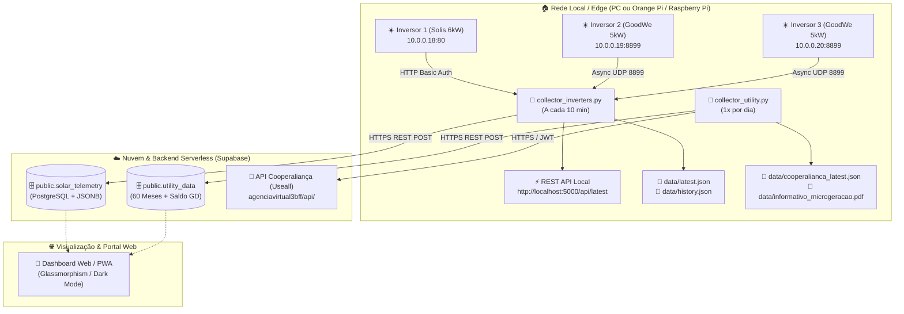

# ☀️ Solar Hub & Energy Management

Sistema integrado de monitoramento fotovoltaico em tempo real e gestão contábil/energética com a concessionária de energia (**Cooperaliança**). 

Projetado para consolidar usinas solares multimarcas (**Solis** + **GoodWe**) em uma única infraestrutura moderna, alimentada por coletores locais leves (compatíveis com Windows, Linux e Raspberry Pi/Orange Pi) com sincronização em tempo real para banco de dados em nuvem (**Supabase PostgreSQL com JSONB** e **MCP**).

---

## 📌 1. Visão Geral da Usina Solar

* **Potência Total Homologada:** **16.0 kWp**
* **Distribuidora de Energia:** **Cooperaliança** (Içara e região - Sul de Santa Catarina)
* **Unidade Consumidora Geradora (GD):** `1000000001` (100% dos créditos direcionados)
* **Unidades Consumidoras Vinculadas:** `1000000002` e `1000000003`
* **Saldo Atual de Créditos GD:** **9.066,00 kWh** *(Vencimento parcial em 01/08/2031)*

### 🔌 Inversores Físicos em Operação

| # | Inversor | Modelo | Potência | IP Local | Protocolo / Porta | Identificador / Serial |
|---|---|---|---|---|---|---|
| **1** | **Solis / Ginlong** | SH1ES160 | ~6.0 kW | `10.0.0.18` | HTTP Web Status (Porta 80) | SN: `SN-INVERSOR-1` / Logger: `1234567890` |
| **2** | **GoodWe** | GW5000-DNS-30 | 5.0 kW | `10.0.0.19` | GoodWe UDP (Porta 8899) | SN: `GOODWE-SERIAL-1` / MAC: `02:00:00:00:00:99` |
| **3** | **GoodWe** | GW5000-DNS-30 | 5.0 kW | `10.0.0.20` | GoodWe UDP (Porta 8899) | SN: `GOODWE-SERIAL-2` / MAC: `02:00:00:00:00:99` |

---

## 🏗️ 2. Arquitetura do Sistema



---

## 📂 3. Estrutura do Repositório

```text
├── .agents/
│   └── mcp_config.json             # Configuração do servidor MCP Supabase para Antigravity
├── data/                           # Amostras e histórico real em JSON (pronto para o layout)
│   ├── latest.json                 # Telemetria instantânea consolidada da Usina 16kW
│   ├── history.json                # Série temporal das potências para curva diária
│   ├── cooperalianca_latest.json   # 60 meses de faturas, extrato GD I e II, gráficos e tarifas
│   ├── raw_sample_solis.json       # Amostra bruta de todos os parâmetros do Solis LSW-3
│   ├── raw_sample_goodwe_inv2.json # Catálogo completo dos 52 sensores do GoodWe Inv 2 (.19)
│   ├── raw_sample_goodwe_inv3.json # Catálogo completo dos 52 sensores do GoodWe Inv 3 (.20)
│   └── informativo_microgeracao.pdf # PDF oficial emitido pela concessionária
├── .env.example                    # Modelo de variáveis de ambiente
├── .gitignore                      # Regras de exclusão do Git (.env, .venv, logs)
├── config.json                     # Configuração central dos 3 inversores (IPs, portas, credenciais)
├── collector_inverters.py          # Coletor de telemetria (Solis HTTP + GoodWe UDP) + REST API + Sync Supabase
├── collector_utility.py            # Coletor da Cooperaliança (Faturas, GD e PDF) + Sync Supabase
├── requirements.txt                # Dependências Python (goodwe, requests, urllib3)
├── run_inverters.bat               # Atalho Windows para iniciar o coletor dos inversores (porta 5000)
├── run_utility.bat                 # Atalho Windows para sincronizar faturas e créditos da concessionária
├── schema_supabase.sql             # Script SQL de criação das tabelas e políticas RLS no Supabase
└── README.md                       # Documentação técnica mestre do projeto
```

---

## ⚡ 4. Coletores e Sincronização em Nuvem

### A. Coletor dos Inversores (`collector_inverters.py`)
* **Ciclo de Leitura:** A cada 10 minutos (configurável em `config.json`).
* **Solis:** Parseia variáveis internas via HTTP Basic Auth (`webdata_now_p`, `webdata_today_e`, `webdata_total_e`, etc.).
* **GoodWe:** Conexão assíncrona UDP via biblioteca `goodwe` extraindo 52 sensores (potência ativa, strings PV1/PV2, temperatura, tensão/frequência).
* **API REST Local:** Disponível em `http://localhost:5000/api/latest` e `/api/history`.
* **Sync Supabase:** Insere snapshot na tabela `public.solar_telemetry`.

### B. Coletor da Concessionária (`collector_utility.py`)
* **Autenticação:** Login automatizado direto na API REST da Useall com JWT.
* **Histórico de 60 Meses:** `GET /Fatura/RecuperarHistoricoFaturaConsumo60Meses` para as 3 UCs.
* **Extrato de Geração Distribuída:** `GET /GeracaoDistribuida/RecuperarDadosHistoricoGeracao` com todas as operações de Injeção e Compensação separadas por **GD I (Art. 26)** e **GD II (Art. 27 - Lei 14.300)**.
* **Gráfico de 12 Meses:** `GET /GeracaoDistribuida/BuscaDadosHistoricoGeracaoConsumo`.
* **Download de PDF:** `POST /GeracaoDistribuida/InformativoMicrogeracao` gerando o PDF oficial.
* **Sync Supabase:** Atualiza os dados na tabela `public.utility_data`.

---

## 🚀 5. Como Configurar e Executar

### 1. Criar Ambiente Virtual e Instalar Dependências
```powershell
python -m venv .venv
.venv\Scripts\activate
pip install -r requirements.txt
```

### 2. Configurar Variáveis de Ambiente (`.env`)
Copie o arquivo `.env.example` para `.env` e preencha as credenciais:
```env
SUPABASE_URL=https://edezivabvjpygfbvvfvl.supabase.co
SUPABASE_ANON_KEY=sua_chave_anon
SUPABASE_SERVICE_ROLE_KEY=sua_chave_service_role
SUPABASE_DB_PASSWORD="sua_senha_do_banco"
COOPERALIANCA_CPF="00000000000"
COOPERALIANCA_SENHA="sua_senha"
```

### 3. Criar as Tabelas no Supabase
Execute o script [schema_supabase.sql](file:///c:/Users/Diego/Dev/schema_supabase.sql) no **SQL Editor** do Supabase.

### 4. Executar os Coletores
* **Inversores (Tempo Real + Nuvem):**
  ```powershell
  # Rodar pelo script interativo:
  run_inverters.bat

  # Ou direto via terminal:
  python collector_inverters.py --once
  ```
* **Concessionária (Faturas, GD + Nuvem):**
  ```powershell
  # Rodar pelo script interativo:
  run_utility.bat

  # Ou direto via terminal:
  python collector_utility.py --pdf
  ```

---

## 🖥️ 6. Recomendações de Hardware para Servidor Edge (24/7)

Para rodar os scripts 24 horas por dia em rede local (sem precisar deixar o computador pessoal ligado):

1. **Mini PC Corporativo Usado (Dell OptiPlex Micro / Lenovo ThinkCentre Tiny):**
   * *Faixa de Preço:* R$ 450 – R$ 650 no Mercado Livre.
   * *Especificações:* Intel Core i3/i5, 8GB RAM, SSD 120/240GB.
   * *Consumo:* 10W a 15W.
   * *Uso:* Melhor custo-benefício disparado para servidor doméstico (Home Assistant, Docker, Pi-hole, Plex e Coletor Solar).
2. **Orange Pi Zero 3 (4GB RAM):**
   * *Faixa de Preço:* R$ 280 – R$ 380.
   * *Consumo:* ~2W a 3W.
   * *Uso:* Excelente SBC de baixo custo com Linux completo.
3. **Raspberry Pi 5 (4GB RAM):**
   * *Faixa de Preço:* R$ 750 – R$ 950.
   * *Uso:* Linha oficial com ecossistema líder de mercado.

---

## 🎯 7. Roadmap do Portal Web (Dashboard)

1. **Gauges & Telemetria em Tempo Real:** Medidor central animado de 0 a 16 kW + cards individuais dos 3 inversores (temperatura, tensões de string PV1/PV2).
2. **Gráfico Diário & Histórico:** Curva de geração solar horária e comparativo semanal/mensal.
3. **Banco de Créditos GD:** Card visual da "Poupança Energética" com **9.066 kWh** (~R$ 8.000,00) e alertas de vencimento.
4. **Módulo de Faturas:** Histórico de consumo x injeção de 60 meses, demonstrativo de economia e download de faturas/PIX.
5. **Hospedagem Custo Zero:** Deploy contínuo na Vercel ou Cloudflare Pages conectado ao Supabase.
