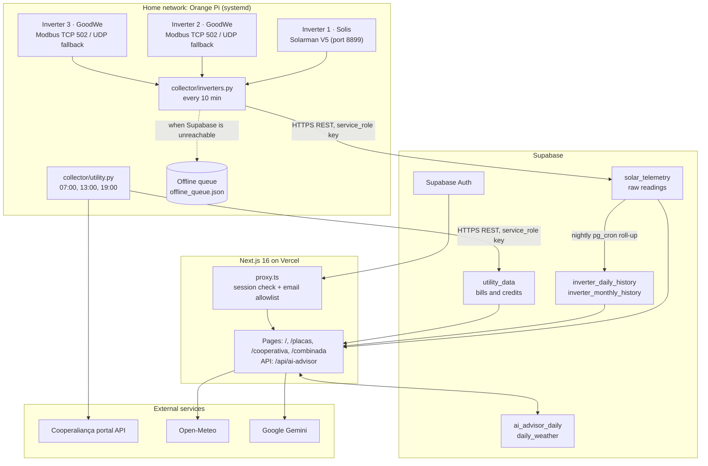

<div align="center">

# Solar Hub

[](https://github.com/DiegoHahn/Solar-hub/actions/workflows/ci.yml)
[](LICENSE)
[](https://solar-hub-diego-2112.vercel.app/demo)

[Versão em Português](README.pt-BR.md) • [Demo](#demo) • [Architecture](#architecture) • [Setup](#setup) • [Testing and CI](#testing-and-ci) • [Known limitations](#known-limitations-and-trade-offs) • [What I learned](#what-i-learned-and-what-id-do-differently)

</div>

---

My family has a small solar plant with three inverters from two different brands: one Solis and two GoodWe. Each brand has its own app and its own cloud, and none of them shows the whole plant in one place. The electricity bill and the solar credits live on a third site, the portal of the local utility cooperative (Cooperaliança).

Solar Hub puts all of that in one dashboard. A small Python collector on an Orange Pi reads the inverters directly on the home network, pushes the readings to Supabase, and also pulls the billing and credit data from the utility portal a few times a day. A Next.js dashboard shows generation, inverter details, credits and bills, and a daily analysis written by Google Gemini from those numbers.

**Live demo:** [solar-hub-diego-2112.vercel.app/demo](https://solar-hub-diego-2112.vercel.app/demo). It runs on bundled sample data, needs no login, and has an EN / PT language toggle.

## Demo

Screenshots from the [demo](https://solar-hub-diego-2112.vercel.app/demo):

<div align="center">
  
</div>

<br />

| Inverters | Utility cooperative |
| :---: | :---: |
|  |  |
| **Combined analysis and AI advisor** | **Mobile** |
|  |  |

## What it does

- **Reads the inverters locally, without the vendor clouds.** The Solis inverter is read through its Solarman LSW-3 Wi-Fi logger using the Solarman V5 protocol (Modbus RTU frames wrapped in Solarman's own header, port 8899), plus the logger's `status.html` page. The GoodWe inverters are read over Modbus TCP on port 502 through the [`goodwe`](https://pypi.org/project/goodwe/) library, with a fallback to its UDP protocol.
- **Polls every 10 minutes.** The interval is `poll_interval_seconds` in `collector/config.json` (default 600). The inverters are read one after another in each cycle.
- **Keeps working when the internet goes down.** If a push to Supabase fails, the snapshot goes into a local JSON queue (capped at 500 entries) and is sent in order on the next successful cycle.
- **Avoids wearing out the SD card.** The latest reading and the short history live in memory. The collector writes to disk only for the offline queue, or when started with `--save-local`. JSON files are written through a temp file and an atomic rename.
- **Syncs the utility data.** `collector/utility.py` logs into the Cooperaliança portal API at 07:00, 13:00 and 19:00 (systemd timer), and stores the 60-month invoice history, the distributed-generation credit balances, and the current tariff. It also downloads the monthly microgeneration statement PDF to the device.
- **Shows it all in one dashboard** in English and Brazilian Portuguese, with four pages: overview, inverters, utility, and combined analysis.
- **Writes a daily analysis with Gemini.** The `/api/ai-advisor` route sends today's telemetry, the latest bill, credits and weather to Gemini and gets back a structured analysis. It does not forecast anything; it explains the numbers that are already there. One analysis per day and language is cached in Supabase, the primary model has a daily call limit before the route switches to fallback models, and forced regenerations have a 10-minute cooldown.
- **Correlates generation with weather** from [Open-Meteo](https://open-meteo.com/) (irradiance, sunshine hours, rain), cached daily in the `daily_weather` table.

The parts I found most interesting to build:

- Working out the Solis register map (which holding register is PV voltage, grid frequency, daily yield, temperature, and the scale factor of each) and the GoodWe sensor mapping. See [Inverter protocols](#inverter-protocols).
- The offline queue and the SD-card-friendly storage on a device that runs 24/7.
- Tests that use real data: inverter responses, utility API responses and dashboard queries captured from production and anonymized before they were committed (see [ADR 0005](docs/adr/0005-tests-with-anonymized-real-data.md)).

## Architecture



The reasoning behind the main choices is in the [Architecture Decision Records](docs/adr/README.md).

### Inverter protocols

| Inverter | Interface | Protocol | Main readings |
| :--- | :--- | :--- | :--- |
| Solis | Solarman LSW-3 Wi-Fi logger | Solarman V5 on port 8899, holding registers 0 to 39, plus the logger's `status.html` | Active power, grid voltage, current and frequency, PV1/PV2 voltage and current, daily and total yield, internal temperature, Wi-Fi signal |
| GoodWe | Wi-Fi module | Modbus TCP on port 502 via the `goodwe` library, UDP fallback | Power, PV strings, grid values, temperatures, daily and total yield |

Solis holding registers used by the parser (`parse_solis_status` in `collector/inverters.py`):

| Register | Value | Scale |
| :---: | :--- | :--- |
| 6 / 7 | PV1 voltage / current | 0.1 V / 0.01 A |
| 8 / 9 | PV2 voltage / current | 0.1 V / 0.01 A |
| 12 | Active power | 10 W |
| 14 / 15 / 16 | Grid frequency / voltage / current | 0.01 Hz / 0.1 V / 0.01 A |
| 22 | Total yield | 1 kWh |
| 25 | Daily yield | 0.01 kWh |
| 36 | Internal temperature | 0.1 °C |

### Tech stack

- **Dashboard:** Next.js 16 (App Router, Server Components), React 19, TypeScript, Tailwind CSS 4, Recharts, Radix UI primitives, Remix Icons. The i18n layer (`pt-BR` and `en`) is written in the project, without a library.
- **Collector:** Python 3.10+, `pysolarmanv5`, `goodwe`, `requests`, run by systemd on an Orange Pi.
- **Data:** Supabase (PostgreSQL, Auth, Row Level Security, `pg_cron`). Inverter details are stored as `JSONB` in each telemetry row.
- **AI:** Google Gemini, called from a Next.js route handler.
- **Hosting:** Vercel for the dashboard ([ADR 0003](docs/adr/0003-nextjs-app-router-server-components-gru1.md)).

### Repository layout

```text
collector/            Python collectors that run on the Orange Pi
  inverters.py        inverter polling, offline queue, small local REST API (/api/latest, /api/history, /api/health)
  utility.py          Cooperaliança billing and credits sync
  deploy/             systemd service and timer units
  tests/              pytest suite with anonymized fixtures
dashboard/            Next.js app
  src/app/            pages, /api/ai-advisor, login, demo routes
  src/lib/            Supabase queries, weather, AI quota, auth allowlist, demo data
  src/i18n/           dictionaries and formatters
  e2e/                Playwright tests
  scripts/            fixture capture and anonymization, telemetry check, screenshots
supabase/migrations/  schema, RLS policies, functions, pg_cron job
docs/adr/             Architecture Decision Records
```

## Setup

### Requirements

- Python 3.10+ for the collector
- Node.js 20.9+ for the dashboard
- A Supabase project with the migrations from `supabase/migrations/` applied

### Collector

```bash
git clone https://github.com/DiegoHahn/Solar-hub.git
cd Solar-hub/collector

python3 -m venv .venv
source .venv/bin/activate  # Windows: .venv\Scripts\activate
pip install -r requirements.txt

cp .env.example .env                 # Supabase and utility portal credentials
cp config.example.json config.json   # inverter IPs, serial numbers, poll interval
chmod 600 .env
```

Run a single cycle to check that every inverter answers:

```bash
python3 inverters.py --once
```

Install the systemd units to run it continuously:

```bash
sudo cp deploy/solar-inverters@.service deploy/solar-utility@.service deploy/solar-utility@.timer /etc/systemd/system/
sudo systemctl daemon-reload
sudo systemctl enable --now solar-inverters@$USER.service
sudo systemctl enable --now solar-utility@$USER.timer
```

### Dashboard

```bash
cd dashboard
npm install
cp .env.example .env.local
npm run dev
```

Then open `http://localhost:3000`. The demo works without Supabase data at `http://localhost:3000/demo`.

### Environment variables

**Dashboard** (`dashboard/.env.local`, and the Vercel project settings):

| Variable | Purpose |
| :--- | :--- |
| `NEXT_PUBLIC_SUPABASE_URL` | Supabase project URL |
| `NEXT_PUBLIC_SUPABASE_PUBLISHABLE_KEY` | Public (publishable/anon) key |
| `ALLOWED_EMAILS` | Comma-separated emails allowed in. An empty list blocks everyone |
| `GEMINI_API_KEY` | Google AI Studio key |
| `GEMINI_MODEL` | Primary model for the AI advisor |
| `GEMINI_MODEL_FALLBACKS` | Comma-separated fallback models, in order |
| `GEMINI_PRIMARY_MAX_QUOTA` | Daily calls to the primary model before switching to the fallbacks |
| `NEXT_PUBLIC_SOLAR_LATITUDE` / `_LONGITUDE` | Plant location for Open-Meteo |
| `NEXT_PUBLIC_SOLAR_TILT` / `_AZIMUTH` | Panel tilt and orientation, in degrees |
| `NEXT_PUBLIC_PLANT_DC_KWP` | DC module capacity (kWp), used for the performance ratio and estimates |

**Collector** (`collector/.env`):

| Variable | Purpose |
| :--- | :--- |
| `SUPABASE_URL` | Supabase project URL |
| `SUPABASE_SERVICE_ROLE_KEY` | Write key. It bypasses RLS, so it only lives on the Orange Pi |
| `COOPERALIANCA_CPF` / `COOPERALIANCA_SENHA` | Utility portal login |
| `COOPERALIANCA_TOKEN_EXTERNO` | Token the portal API expects in the `use-token-externo` header |
| `COOPERALIANCA_UCS` | Comma-separated consumer units. The first one is the unit with the solar plant |

The inverter list (IPs, ports, serial numbers, plant name and capacity, poll interval) goes in `collector/config.json`, created from `collector/config.example.json`.

## Security

- **Secrets:** `.env`, `.env.local` and `collector/config.json` are git-ignored. Only `*.example` templates are committed. CI runs Trivy (dependencies, secrets, misconfigurations) and Semgrep on every PR.
- **Login:** Supabase Auth with Google or email and password, through `@supabase/ssr`. The Next.js proxy (`dashboard/src/proxy.ts`) refreshes the session on each request, sends visitors without a session to `/login`, and signs out anyone whose email is not in `ALLOWED_EMAILS`. The allowlist fails closed: if the variable is empty, nobody gets in.
- **Session cookies:** `@supabase/ssr` keeps the session in cookies that the browser client can read, so they are **not** `httpOnly`. The app sets `X-Frame-Options`, `frame-ancestors 'none'`, `nosniff`, a referrer policy and a permissions policy, but no script CSP yet.
- **Database:** RLS is on for every table. Telemetry, history and utility tables have no write policy for app users; only the collector's `service_role` key writes to them. Any authenticated user can read them, and can insert and update `ai_advisor_daily` and `daily_weather`, which the dashboard uses as caches. See [Known limitations](#known-limitations-and-trade-offs) for what this means.
- **Demo:** `/demo` sets an `httpOnly` cookie that switches the data source to bundled JSON. Demo mode never queries Supabase and never calls Gemini.

## Testing and CI

| Layer | Tools | Command | What it covers |
| :--- | :--- | :--- | :--- |
| Dashboard unit and components | Vitest, Testing Library, MSW | `npm run test:coverage` | Generation math, Brasília timezone boundaries, utility data normalization, i18n, component states |
| Dashboard integration | Vitest | `npm run test:integration` | Queries and RLS against a real Supabase project, Open-Meteo contract |
| End-to-end | Playwright | `npm run e2e` | Production build: login flow, route guards, open redirect checks, security headers, demo, layouts |
| Collector | pytest, ruff | `pytest` | Solis and GoodWe parsers on captured responses, offline queue, Supabase push against a local HTTP server, utility sync |
| On the device | pytest | `pytest -m live` | Real inverters and the real utility portal. Run by hand on the Orange Pi |

CI fails when coverage drops below 80% (collector total; dashboard lines, functions and statements, 70% for branches). The `CI` workflow runs on every PR: dashboard lint, typecheck, tests and build; collector lint, format check and tests on Python 3.10 and 3.14; Trivy; Semgrep. The integration and E2E job needs live Supabase credentials, so it runs on pushes to `main` and once a day, not on PRs.

### Telemetry monitoring

`.github/workflows/monitor.yml` runs every 30 minutes between 06:00 and 19:59 BRT and runs `npm run telemetry:check`. The check fails, and GitHub emails me, if the newest telemetry row is older than 30 minutes during daylight, or if the utility data is older than 26 hours.

A nightly `pg_cron` job at 03:10 BRT rolls up the last seven days of raw telemetry into `inverter_daily_history` and `inverter_monthly_history`, then deletes raw readings older than 90 days for days that already have a total. The dashboard reads the history tables first, so older days keep their totals.

### Workflow

GitHub Flow: every change goes through a branch and a PR, CI must pass, and PRs are squash-merged. Direct pushes to `main` are blocked. Commits follow [Conventional Commits](https://www.conventionalcommits.org/), and [release-please](https://github.com/googleapis/release-please) generates the `CHANGELOG.md`, tags and releases. Vercel deploys `main`. The Orange Pi is updated by hand (`git pull` and a systemd restart), and database migrations are applied by hand, not by CI. Details in [CONTRIBUTING.md](CONTRIBUTING.md).

## Known limitations and trade-offs

- **Authorization is enforced in the app, not in the database.** The email allowlist lives in the Next.js proxy. The RLS read policies are `TO authenticated USING (true)`, so any account that gets a valid Supabase session could read every table straight from the Supabase API, including the utility data, which has the account holder's CPF. Moving the allowlist into the RLS policies is the next fix.
- **Replaying the offline queue is not idempotent.** `solar_telemetry.recorded_at` has no unique constraint, and the collector does a plain `POST`. If a request reaches Supabase but the response is lost (a timeout, for example), that snapshot stays in the queue and is sent again, which creates a duplicate row.
- **The queue has a limit.** It keeps the last 500 snapshots, about three and a half days at 10-minute intervals. A longer outage drops the oldest readings.
- **Three inverters are partly hard-coded.** The collector reads any number of inverters from `config.json`, but the in-memory history has fixed `inv_1_w` to `inv_3_w` fields, and only two inverter types are supported.
- **It is polling, not streaming.** A reading every 10 minutes is enough for daily totals and charts, but the dashboard is never more current than the last cycle, and short events between readings are not seen.
- **The utility integration depends on an undocumented portal API.** If the cooperative changes its portal, `utility.py` breaks. Network and server errors at login are retried twice (after 1 and 5 minutes), and the monitor flags data older than 26 hours.
- **Session cookies are readable by JavaScript**, as described in [Security](#security).
- **The collector is a script, not a package.** Configuration is loaded at import time, state lives in module globals, and it logs with `print`. It works on the device, but it is harder to test and extend than it should be.

## What I learned and what I'd do differently

<!-- TODO Diego: revise in your own words -->

- Reverse-engineering the Solis registers took more time than any other part. Capturing real responses as fixtures early made it possible to change the parser without going to the Orange Pi every time.
- Checking access only in the middleware was the easy path. Next time I would put authorization in the database from the start and treat the app check as a second layer.
- I would design the telemetry table with a unique key and make every write an upsert from day one. Retries and offline queues are much simpler when sending the same row twice is harmless.
- I would start the collector as a small installable package with a config object and logging, instead of a script that grew.
- Running the dashboard against a real database in CI caught bugs that mocks hid, but it also means those tests cannot run on PRs from forks. A local Supabase instance in CI would fix that.

## License

MIT. See [LICENSE](LICENSE).
