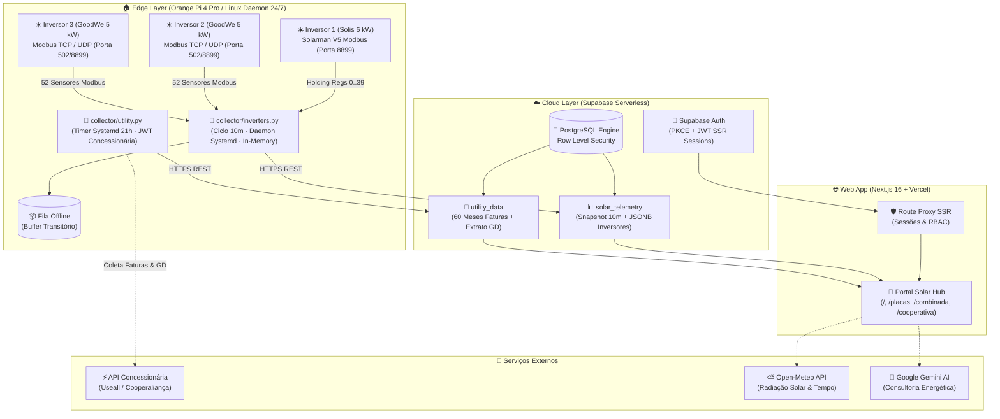

<div align="center">

# Solar Hub

[](https://nextjs.org/)
[](https://react.dev/)
[](https://www.typescriptlang.org/)
[](https://www.python.org/)
[](https://supabase.com/)
[](https://tailwindcss.com/)
[](https://ai.google.dev/)

[Visão Geral](#1-visão-geral) • [Arquitetura](#2-arquitetura-do-sistema) • [Protocolos dos Inversores](#3-protocolos-e-engenharia-reversa-iot) • [Stack Tecnológica](#4-stack-tecnológica) • [Instalação](#6-instalação-e-execução) • [Segurança](#7-segurança-e-autenticação)

</div>

---

## 1. Visão Geral

O **Solar Hub** é uma plataforma de telemetria fotovoltaica e inteligência energética projetada para unificar usinas solares multimarcas (**Solis** + **GoodWe**) e concessionárias de energia em um dashboard analítico unificado em tempo real.

O projeto resolve o problema de fragmentação de dados em usinas com múltiplos inversores de fabricantes distintos, substituindo portais proprietários dispersos por uma **arquitetura Edge-to-Cloud** resiliente, com telemetria direta via rede local, zero dependência de clouds externas para coleta, e análise preditiva com Inteligência Artificial.

### Destaques de Engenharia
* **Coleta Edge 100% Local:** Comunicação direta com os inversores na rede local via Modbus TCP, UDP e Solarman V5 frame parsing.
* **Zero Armazenamento Desnecessário em Disco:** Telemetria em memória com push direto via HTTPS/REST para nuvem, ideal para placas embarcadas (Orange Pi / Raspberry Pi) sem desgaste de armazenamento eMMC/SD.
* **Fila de Tolerância a Falhas:** Buffer offline local caso a internet caia, sincronizando snapshots retroativos assim que a conexão restabelece.
* **Automação Contábil GD:** Scraper/integrador automatizado com a concessionária de energia (**Cooperaliança**), extraindo histórico de faturas de 60 meses, extrato detalhado de créditos GD I e GD II e demonstrativo financeiro.
* **Interface de Alta Fidelidade:** Dashboard em Next.js 16 (App Router + Turbopack), SSR com `@supabase/ssr`, Tailwind CSS, visual Glassmorphism e gráficos interativos com Recharts.
* **Consultor Energético IA:** Módulo de análise inteligente integrado com o **Google Gemini**, avaliando perdas de eficiência, projeção de economia e saúde dos inversores.

---

## 2. Arquitetura do Sistema



---

## 3. Protocolos e Engenharia Reversa IoT

O sistema interroga 3 inversores simultaneamente na rede local em menos de 2 segundos, mantendo isolamento completo entre as telemetrias:

| Inversor | Potência | Interface Física | Protocolo de Telemetria | Parâmetros Extraídos |
| :--- | :--- | :--- | :--- | :--- |
| **Solis / Ginlong** | ~6.0 kW | Datalogger Solarman LSW-3 (IP Local) | **Solarman V5 Frame Parser** (Porta `8899`) + Fallback HTTP Status | Potência ativa (W), Tensão da Rede CA (V), Corrente CA (A), Freq (Hz), Strings PV1/PV2 (V, A, W), Temp. Interna (°C), Acumulado Hoje e Total (kWh), Wi-Fi RSSI. |
| **GoodWe** | 5.0 kW | Módulo Wi-Fi GoodWe DNS (IP Local) | **Modbus TCP** (Porta `502`) com Fallback UDP (Porta `8899`) | 52 registradores elétricos: Potência Ativa, Aparente e Reativa, Fator de Potência (FP), Temp. Interna e Dissipador Térmico (°C), Horas de Operação, Vbus, Strings PV1/PV2. |

### Decodificação Modbus Solarman V5 (Solis):
O coletor empacota quadros Modbus RTU encapsulados em cabeçalhos proprietários Solarman V5 (`0xA5`), lendo os registradores de retenção (*holding registers* `0..39`):
* `Reg[06]`: Tensão da String PV1 (fator `0.1 V`)
* `Reg[07]`: Corrente da String PV1 (fator `0.01 A`)
* `Reg[08]`: Tensão da String PV2 (fator `0.1 V`)
* `Reg[09]`: Corrente da String PV2 (fator `0.01 A`)
* `Reg[14]`: Frequência da Rede Elétrica (fator `0.01 Hz`)
* `Reg[15]`: Tensão da Rede Elétrica CA (fator `0.1 V`)
* `Reg[16]`: Corrente da Rede Elétrica CA (fator `0.01 A`)
* `Reg[25]`: Energia Gerada Hoje (fator `0.01 kWh`)
* `Reg[36]`: Temperatura Interna do Inversor (fator `0.1 °C`)

---

## 4. Stack Tecnológica

### Core & Frontend
* **Framework:** [Next.js 16](https://nextjs.org/) (App Router, Turbopack, React 19, TypeScript).
* **Estilização:** [Tailwind CSS](https://tailwindcss.com/) com paleta HSL balanceada, modo escuro nativo e estética Glassmorphism.
* **Visualização de Dados:** [Recharts](https://recharts.org/) com interpolação monotônica, curvas empilhadas, tooltips responsivos e comparativos históricos.
* **Componentes & Primitivas:** Radix UI, Tremor primitives e Remix Icons.
* **IA Generativa:** Modelos Gemini.

### Backend, IoT & Edge
* **Linguagem Edge:** Python 3.10+.
* **Bibliotecas IoT:** `pysolarmanv5`, `goodwe`, `requests`, `urllib3`.
* **Serviço do Sistema:** Daemons nativos `systemd` no Linux com auto-restart e temporizadores cron.
* **Hardware Edge:** Orange Pi 4 Pro (SoC Octa-core ARM64, consumo ~4W) operando 24 horas por dia.

### Nuvem & Banco de Dados
* **Banco de Dados:** [Supabase](https://supabase.com/) PostgreSQL 15 com colunas estruturadas e `JSONB` flexível para séries de sensores.
* **Segurança de Acesso:** Row Level Security (RLS) e autenticação segura com `@supabase/ssr` e Next.js 16 Route Proxy.

---

## 5. Estrutura do Repositório

```text
├── collector/                          # Edge: coletores Python (Orange Pi / Raspberry Pi)
│   ├── inverters.py                    # Telemetria dos 3 inversores (Solarman V5 / Modbus TCP / UDP) + API REST local
│   ├── utility.py                      # Faturas, extrato de GD e créditos da concessionária
│   ├── config.example.json             # Modelo de topologia: IPs, portas e seriais dos inversores
│   ├── .env.example                    # Credenciais do Supabase (service_role) e da concessionária
│   ├── requirements.txt
│   └── deploy/
│       ├── solar-inverters@.service    # Unit systemd do coletor 24/7
│       ├── solar-utility@.service      # Unit systemd da sincronização da concessionária
│       ├── solar-utility@.timer        # Agendamento diário (21h)
│       └── run_*.sh                    # Execução manual com watchdog
├── dashboard/                          # Web: Next.js 16 (App Router)
│   └── src/
│       ├── app/                        # Rotas: /, /placas, /combinada, /cooperativa, /login, /api/ai-advisor
│       ├── components/                 # Cards, gráficos Recharts, navegação
│       ├── lib/                        # Queries Supabase, clima, cota da IA, tipos
│       └── proxy.ts                    # Proteção de rotas por sessão
└── supabase/
    └── migrations/                     # Schema, índices e políticas RLS (Supabase CLI)
```

### Páginas do Dashboard

| Rota | Conteúdo | Fonte dos dados |
| :--- | :--- | :--- |
| `/` Início | Potência instantânea e % da capacidade, geração e economia do dia, saldo de créditos, curva solar de hoje, resumo dos inversores e clima dos últimos 7 dias | `solar_telemetry`, `utility_data`, Open-Meteo |
| `/placas` Placas | Geração por dia/mês/ano, cards detalhados de cada inversor (strings PV1/PV2, rede CA, sensores Modbus) e tabela comparativa de telemetria | `solar_telemetry`, `inverter_daily_history`, extrato de GD |
| `/cooperativa` Cooperativa | Saldo de créditos GD, última fatura, balanço energético de 12 meses (injeção x compensação x saldo) e extrato GD com filtros | `utility_data` |
| `/combinada` Análise | Consultor IA (análise diária e mensal), fluxo de energia usina → rede → créditos e eficiência frente à irradiação de até 90 dias | Gemini, `utility_data`, `solar_telemetry`, Open-Meteo |

A rota `/api/ai-advisor` gera a análise do Consultor IA com o modelo configurado em `GEMINI_MODEL`, recorre aos modelos de `GEMINI_MODEL_FALLBACKS` quando ele falha ou atinge a cota diária, e guarda uma análise por dia na tabela `ai_advisor_daily`.

---

## 6. Instalação e Execução

### Pré-requisitos
* Python 3.10+ (coletores)
* Node.js 20.9+ (dashboard)
* Projeto no Supabase com as migrations de `supabase/migrations` aplicadas (`supabase db push` ou SQL Editor, na ordem dos arquivos)

### 1. Coletores (Edge)
```bash
git clone https://github.com/DiegoHahn/Solar-hub.git
cd Solar-hub/collector

python3 -m venv .venv
source .venv/bin/activate  # No Windows: .venv\Scripts\activate
pip install -r requirements.txt

cp .env.example .env                 # credenciais e UCs
cp config.example.json config.json   # IPs e seriais dos inversores
```

Coleta de teste para validar a comunicação com os inversores:
```bash
python3 inverters.py --once
```

Execução permanente no Linux (o sufixo após `@` é o usuário dono do clone em `/home/<usuário>/Solar-hub`):
```bash
sudo cp deploy/solar-inverters@.service deploy/solar-utility@.service deploy/solar-utility@.timer /etc/systemd/system/
sudo systemctl daemon-reload
sudo systemctl enable --now solar-inverters@$USER.service
sudo systemctl enable --now solar-utility@$USER.timer
```

### 2. Dashboard Web
```bash
cd dashboard
npm install
cp .env.example .env.local
npm run dev
```
Acesse **`http://localhost:3000`**.

Scripts de qualidade:
```bash
npm run lint        # ESLint (next/core-web-vitals + typescript)
npm run typecheck   # tsc --noEmit
npm test            # Vitest
```

### Variáveis de Ambiente

**Dashboard** (`dashboard/.env.local`, e nas variáveis do projeto na Vercel):

| Variável | Uso |
| :--- | :--- |
| `NEXT_PUBLIC_SUPABASE_URL` | URL do projeto Supabase |
| `NEXT_PUBLIC_SUPABASE_PUBLISHABLE_KEY` | Chave pública (publishable/anon); o acesso aos dados depende da sessão do usuário e do RLS |
| `ALLOWED_EMAILS` | E-mails autorizados no login com Google, separados por vírgula |
| `GEMINI_API_KEY` | Chave do Google AI Studio para o Consultor IA |
| `GEMINI_MODEL` | Modelo primário do Consultor IA |
| `GEMINI_MODEL_FALLBACKS` | Modelos de reserva, em ordem de prioridade, separados por vírgula |
| `GEMINI_PRIMARY_MAX_QUOTA` | Máximo de chamadas diárias ao modelo primário antes de usar os de reserva |
| `NEXT_PUBLIC_SOLAR_LATITUDE` / `_LONGITUDE` | Localização da usina para a previsão e o histórico da Open-Meteo |
| `NEXT_PUBLIC_SOLAR_TILT` / `_AZIMUTH` | Inclinação e orientação dos painéis (graus) |

**Coletores** (`collector/.env`):

| Variável | Uso |
| :--- | :--- |
| `SUPABASE_URL` | URL do projeto Supabase |
| `SUPABASE_SERVICE_ROLE_KEY` | Chave de gravação dos coletores (ignora RLS; fica só no dispositivo edge) |
| `COOPERALIANCA_CPF` / `COOPERALIANCA_SENHA` | Login no portal da concessionária |
| `COOPERALIANCA_TOKEN_EXTERNO` | Token exigido pela API Useall no cabeçalho `use-token-externo` |
| `COOPERALIANCA_UCS` | Unidades consumidoras do titular, separadas por vírgula; a primeira é a UC geradora |

A topologia dos inversores (IPs, portas, seriais, nome e capacidade da usina) fica em `collector/config.json`, a partir de `collector/config.example.json`.

---

## 7. Segurança e Autenticação

* **Segredos fora do repositório:** `.env`, `.env.local` e `collector/config.json` são ignorados pelo git; o repositório traz apenas modelos (`*.example`).
* **Rotas protegidas por sessão:** `@supabase/ssr` + Proxy do Next.js 16 redirecionam usuários não autenticados para `/login`; o login com Google é restrito aos e-mails de `ALLOWED_EMAILS`.
* **RLS no banco:** todas as tabelas exigem usuário autenticado para leitura. Nenhuma política de escrita é concedida a `anon`/`authenticated` nas tabelas de dados; os coletores gravam com a `service_role` key, que fica apenas no dispositivo edge.
* **Cadastro fechado:** o cadastro público do Supabase Auth deve permanecer desativado, para que só as contas criadas pelo administrador obtenham sessão.

---

## Licença

Distribuído sob a licença **MIT**. Veja `LICENSE` para mais informações.
