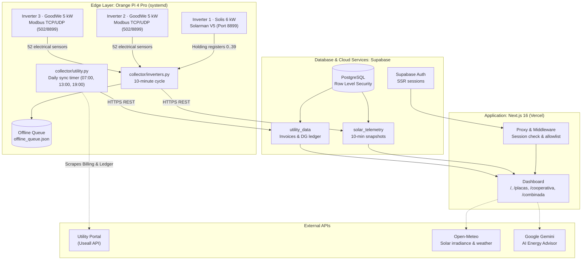

<div align="center">

# Solar Hub

[](https://github.com/DiegoHahn/Solar-hub/actions/workflows/ci.yml)

[](https://nextjs.org/)
[](https://react.dev/)
[](https://www.typescriptlang.org/)
[](https://www.python.org/)
[](https://supabase.com/)
[](https://tailwindcss.com/)
[](https://ai.google.dev/)

[Versão em Português](README.pt-BR.md) • [Overview](#1-overview) • [Live Demo](#live-demo) • [Architecture](#2-system-architecture) • [IoT & Inverter Protocols](#3-protocols-and-iot-reverse-engineering) • [Tech Stack](#4-technology-stack) • [Repository Structure](#5-repository-structure) • [Setup & Installation](#6-setup-and-installation) • [Security & Auth](#7-security-and-authentication) • [Testing & CI](#8-testing-and-continuous-integration) • [Telemetry Monitoring](#9-telemetry-health-monitoring) • [Development Workflow](#10-development-workflow)

</div>

---

**Live Interactive Demo:** [solar-hub-diego-2112.vercel.app/demo](https://solar-hub-diego-2112.vercel.app/demo) — mock data, no login required, with live language toggle (EN / PT).

## 1. Overview

**Solar Hub** is an enterprise-grade solar telemetry and energy intelligence platform engineered to unify multi-vendor photovoltaic plants (**Solis** + **GoodWe**) and utility grid data into a cohesive, real-time analytics dashboard.

The system addresses data fragmentation across distributed inverters from disparate manufacturers, replacing proprietary vendor cloud silos with a resilient **Edge-to-Cloud architecture**. It provides direct local network acquisition, zero dependency on third-party cloud APIs for collection, automated net metering reconciliations, and predictive AI energy analysis.

### Engineering Highlights
* **100% Local Edge Acquisition:** Direct local-network querying via Modbus TCP, UDP, and Solarman V5 frame parsing.
* **Flash-Wear Elimination:** In-memory telemetry buffering with direct HTTPS/REST push to PostgreSQL, preserving eMMC/SD storage life on embedded single-board computers (Orange Pi / Raspberry Pi).
* **Fault-Tolerant Offline Resiliency:** Local queue buffer captures snapshots during network blackouts and drains sequentially upon WAN reconnection.
* **Automated Utility Metering Reconciliations:** Headless collector queries utility cooperative systems (**Cooperaliança**), retrieving 60-month invoice history, distributed generation credit balances (DG I & DG II), and real-time tariff structures.
* **High-Fidelity Dashboard:** Built on Next.js 16 (App Router + Turbopack), React 19, `@supabase/ssr`, Tailwind CSS glassmorphic aesthetics, and responsive Recharts visual curves.
* **Full Bilingual Support (i18n):** Real-time language switching between English (`en`) and Brazilian Portuguese (`pt-BR`) with localized date, currency, and metric formatters.
* **Gemini AI Energy Advisor:** Integrated with Google Gemini models to assess thermal clipping, cloud irradiance variances, financial payback metrics, and inverter operational health.

---

## Live Demo

Screenshots captured from the [interactive demo environment](https://solar-hub-diego-2112.vercel.app/demo):

<div align="center">
  
</div>

<br />

| Inverters & PV Strings | Utility Cooperative (Net Metering) |
| :---: | :---: |
|  |  |
| **Combined Analysis & AI Advisor** | **Mobile Experience** |
|  |  |

---

## 2. System Architecture



> Core architectural decisions, evaluation criteria, and trade-offs are documented in our [Architecture Decision Records (ADRs)](docs/adr/README.md).

---

## 3. Protocols and IoT Reverse Engineering

The edge collector queries 3 inverters simultaneously over the local LAN in under 2 seconds, maintaining strict isolation between vendor routines:

| Inverter | Nominal Power | Physical Interface | Telemetry Protocol | Key Parameters Extracted |
| :--- | :--- | :--- | :--- | :--- |
| **Solis / Ginlong** | ~6.0 kW | Solarman LSW-3 Datalogger (Local IP) | **Solarman V5 Frame Parser** (Port `8899`) + HTTP Status Fallback | Active Power (W), AC Grid Voltage (V), AC Current (A), Grid Frequency (Hz), PV1/PV2 Strings (V, A, W), Internal Temperature (°C), Daily/Total Yield (kWh), Wi-Fi RSSI. |
| **GoodWe** | 5.0 kW | GoodWe DNS Wi-Fi Module (Local IP) | **Modbus TCP** (Port `502`) with UDP Fallback (Port `8899`) | 52 electrical sensors: Active, Apparent & Reactive Power, Power Factor (PF), Internal & Heatsink Temperature (°C), Operating Hours, DC Bus Voltage (Vbus), PV1/PV2 Strings. |

### Solis Solarman V5 Frame Decoding:
The collector constructs Modbus RTU request frames wrapped in proprietary Solarman V5 headers (`0xA5`), querying holding registers `0..39`:
* `Reg[06]`: String PV1 Voltage (scale factor `0.1 V`)
* `Reg[07]`: String PV1 Current (scale factor `0.01 A`)
* `Reg[08]`: String PV2 Voltage (scale factor `0.1 V`)
* `Reg[09]`: String PV2 Current (scale factor `0.01 A`)
* `Reg[14]`: Grid AC Frequency (scale factor `0.01 Hz`)
* `Reg[15]`: Grid AC Voltage (scale factor `0.1 V`)
* `Reg[16]`: Grid AC Current (scale factor `0.01 A`)
* `Reg[25]`: Daily Generation Yield (scale factor `0.01 kWh`)
* `Reg[36]`: Inverter Internal Temperature (scale factor `0.1 °C`)

---

## 4. Technology Stack

### Core & Frontend
* **Framework:** [Next.js 16](https://nextjs.org/) (App Router, Turbopack, React 19, TypeScript).
* **Internationalization:** Custom zero-dependency, type-safe i18n layer supporting `pt-BR` and `en` with server/client locale propagation.
* **Styling:** [Tailwind CSS](https://tailwindcss.com/) with custom HSL token architecture, dark mode, and glassmorphism styling.
* **Data Visualization:** [Recharts](https://recharts.org/) with monotone interpolation, stacked area curves, and responsive tooltips.
* **UI Primitives:** Radix UI primitives, Tremor components, and Remix Icons.
* **Generative AI:** Google Gemini API with token quota tracking and automated model fallback cascades.

### Edge & IoT
* **Language:** Python 3.10+.
* **IoT Libraries:** `pysolarmanv5`, `goodwe`, `requests`, `urllib3`.
* **System Services:** Linux `systemd` daemon services with automated restart policies and systemd timers.
* **Edge Hardware:** Orange Pi 4 Pro (Octa-core ARM64 SoC, ~4W power draw) operating 24/7 on the local LAN.

### Database & Cloud
* **Database:** [Supabase](https://supabase.com/) PostgreSQL 15 with typed schema tables and structured `JSONB` sensor payloads.
* **Security:** Row Level Security (RLS) enforcement, `@supabase/ssr` server-side session authentication, and Next.js Route Handlers.

---

## 5. Repository Structure

```text
├── collector/                          # Edge: Python IoT daemons (Orange Pi / Raspberry Pi)
│   ├── inverters.py                    # Multi-inverter telemetry engine (Solarman V5 / Modbus TCP / UDP) + Local REST API
│   ├── utility.py                      # Utility billing & net metering ledger collector
│   ├── config.example.json             # Topology template: IPs, ports, and serial numbers
│   ├── .env.example                    # Supabase credentials (service_role) and utility credentials
│   ├── requirements.txt / requirements-dev.txt
│   ├── tests/                          # pytest suite: protocol parsers, offline queue, Supabase mock sink, live hardware
│   └── deploy/
│       ├── solar-inverters@.service    # 24/7 systemd unit service
│       ├── solar-utility@.service      # Utility sync systemd unit
│       └── solar-utility@.timer        # Systemd timer (07:00, 13:00, 19:00)
├── dashboard/                          # Frontend: Next.js 16 (App Router)
│   ├── e2e/                            # End-to-end tests (Playwright)
│   ├── scripts/                        # Fixture capture and anonymization pipelines
│   └── src/
│       ├── app/                        # Next.js App Router: /, /placas, /combinada, /cooperativa, /login, /api
│       ├── components/                 # UI components, Recharts visualizations, navigation
│       ├── i18n/                       # Translation dictionaries, formatters, context, and toggle
│       ├── lib/                        # Supabase client/server queries, weather API, AI quota, auth allowlist
│       └── test/                       # Unit and integration test fixtures
├── docs/
│   ├── adr/                            # Architecture Decision Records (ADRs 0001 - 0005)
│   └── images/                         # Architectural diagrams and screenshot assets
├── supabase/
│   └── migrations/                     # PostgreSQL schema, indexes, RLS policies, and stored procedures
└── .github/                            # CI/CD workflows, automated monitoring, and Dependabot
```

### Dashboard Routes

| Route | Content | Data Source |
| :--- | :--- | :--- |
| `/` Overview | Instant power, capacity factor %, daily generation and financial savings, credit reserve, real-time sun curve, inverter summaries, and 7-day weather efficiency | `solar_telemetry`, `utility_data`, Open-Meteo |
| `/placas` Inverters | Daily/monthly/yearly generation periods, granular individual inverter telemetry cards (PV1/PV2 MPPT strings, AC grid, internal thermals) | `solar_telemetry`, `inverter_daily_history`, DG statement |
| `/cooperativa` Utility | Net metering energy credits, latest utility invoice details, 12-month net balance curve (generation vs grid consumption), and filtered billing statement | `utility_data` |
| `/combinada` Analysis | Gemini AI Energy Advisor (daily & monthly strategic insights), energy flow diagram (production → consumption → grid injection), and solar irradiance correlation (up to 90 days) | Gemini API, `utility_data`, `solar_telemetry`, Open-Meteo |

The `/api/ai-advisor` route generates the AI Advisor analysis with the model set in `GEMINI_MODEL`, falls back to the `GEMINI_MODEL_FALLBACKS` models when it fails or reaches its daily quota, and caches one analysis per day and language in the `ai_advisor_daily` table.

---

## 6. Setup and Installation

### Prerequisites
* Python 3.10+ (for edge collectors)
* Node.js 20.9+ (for web dashboard)
* Supabase project with migrations applied from `supabase/migrations/`

### 1. Edge Collector
```bash
git clone https://github.com/DiegoHahn/Solar-hub.git
cd Solar-hub/collector

python3 -m venv .venv
source .venv/bin/activate  # On Windows: .venv\Scripts\activate
pip install -r requirements.txt

cp .env.example .env                 # Configure Supabase service key & credentials
cp config.example.json config.json   # Configure inverter IPs and serial numbers
```

Run a one-shot validation test across all inverters:
```bash
python3 inverters.py --once
```

Enable Linux systemd services for continuous 24/7 background operation:
```bash
sudo cp deploy/solar-inverters@.service deploy/solar-utility@.service deploy/solar-utility@.timer /etc/systemd/system/
sudo systemctl daemon-reload
sudo systemctl enable --now solar-inverters@$USER.service
sudo systemctl enable --now solar-utility@$USER.timer
```

### 2. Web Dashboard
```bash
cd dashboard
npm install
cp .env.example .env.local
npm run dev
```
Navigate to **`http://localhost:3000`**.

Quality and verification commands:
```bash
npm run lint        # ESLint validation
npm run typecheck   # TypeScript compiler check (tsc --noEmit)
npm test            # Vitest unit & component test suite
```

### Environment Variables

**Dashboard** (`dashboard/.env.local`, and the project environment variables on Vercel):

| Variable | Purpose |
| :--- | :--- |
| `NEXT_PUBLIC_SUPABASE_URL` | Supabase project URL |
| `NEXT_PUBLIC_SUPABASE_PUBLISHABLE_KEY` | Public (publishable/anon) key; data access depends on the user session and RLS |
| `ALLOWED_EMAILS` | Comma-separated emails allowed to sign in (Google or password); an empty list blocks everyone |
| `GEMINI_API_KEY` | Google AI Studio key for the AI Energy Advisor |
| `GEMINI_MODEL` | Primary AI Advisor model |
| `GEMINI_MODEL_FALLBACKS` | Comma-separated fallback models, in priority order |
| `GEMINI_PRIMARY_MAX_QUOTA` | Daily call limit for the primary model before switching to the fallbacks |
| `NEXT_PUBLIC_SOLAR_LATITUDE` / `_LONGITUDE` | Plant location for the Open-Meteo forecast and history |
| `NEXT_PUBLIC_SOLAR_TILT` / `_AZIMUTH` | Panel tilt and orientation (degrees) |
| `NEXT_PUBLIC_PLANT_DC_KWP` | DC module capacity (kWp), used for the performance ratio and the estimates |

**Collectors** (`collector/.env`):

| Variable | Purpose |
| :--- | :--- |
| `SUPABASE_URL` | Supabase project URL |
| `SUPABASE_SERVICE_ROLE_KEY` | Collector write key (bypasses RLS; stays on the edge device only) |
| `COOPERALIANCA_CPF` / `COOPERALIANCA_SENHA` | Utility portal login |
| `COOPERALIANCA_TOKEN_EXTERNO` | Token required by the Useall API in the `use-token-externo` header |
| `COOPERALIANCA_UCS` | Comma-separated consumer units of the account holder; the first one is the generating unit |

The inverter topology (IPs, ports, serial numbers, plant name and capacity) lives in `collector/config.json`, created from `collector/config.example.json`.

---

## 7. Security and Authentication

* **Secrets Management:** `.env`, `.env.local`, and `collector/config.json` are excluded via `.gitignore`. Sample templates (`*.example`) provide configuration schemas. On edge devices, access permissions are restricted using `chmod 600 collector/.env`.
* **Session Protection & Access Allowlist:** Authentication is enforced via `@supabase/ssr` middleware. Unauthenticated requests are redirected to `/login`, while unauthorized emails are rejected using a fail-closed `ALLOWED_EMAILS` allowlist.
* **Row Level Security (RLS):** All database tables require authenticated sessions for read access. Telemetry and billing tables can only be written by the edge service key (`service_role`). AI caches and weather tables allow authenticated writes from serverless functions without exposing elevated keys to clients.
* **Closed Registration:** Public sign-up on Supabase Auth is disabled, ensuring access is strictly restricted to pre-authorized accounts.
* **Strict Demo Isolation:** The public `/demo` route operates purely on in-memory fixtures, without touching live Supabase databases or consuming Google Gemini API quotas.

---

## 8. Testing and Continuous Integration

The test suite emphasizes real data and production-mirroring environments: business rules are validated against sanitized production snapshots, integration queries validate RLS rules against Supabase, and E2E suites exercise compiled application builds.

| Layer | Framework | Command | Scope |
| :--- | :--- | :--- | :--- |
| Unit & Components | Vitest + Testing Library | `npm test` | Generation metrics, Brasília timezone boundaries, utility ledger normalization, i18n dictionaries, and component states (240+ tests) |
| Integration | Vitest | `npm run test:integration` | Real Supabase instance (RLS policies, dashboard queries, data invariant guarantees) and Open-Meteo API contract |
| End-to-End | Playwright | `npm run e2e` | Production build: auth workflows, route guards, open redirect prevention, security headers, and responsive layouts |
| Collector Unit | pytest + ruff | `pytest` | Modbus protocol parsers for Solis and GoodWe, offline retry buffer, and Supabase HTTP client dispatch |
| Hardware Live | pytest | `pytest -m live` | On-device validation: inverter sensory range tolerances and utility API authentication |

---

## 9. Telemetry Health Monitoring

An automated heartbeat monitoring pipeline prevents silent failures in solar collection and utility synchronizations:

* **Scheduled Verification:** The `.github/workflows/monitor.yml` workflow runs every 30 minutes during daytime hours (06:00 to 19:00 BRT / 09:00 to 22:00 UTC) via cron and on-demand (`workflow_dispatch`).
* **Health Evaluation Rules:**
  * **Solar Telemetry (`solar_telemetry`):** Alerts if the latest telemetry timestamp is older than 30 minutes during active sunlight hours. Nighttime hours automatically enter standby to prevent false positives.
  * **Utility Data (`utility_data`):** Alerts if the daily net metering ledger sync is delayed by more than 26 hours.
* **Immediate Alerting:** Any stale telemetry status triggers a job failure on GitHub Actions, delivering email alerts to the repository owner without reliance on external paid monitoring services.

---

## 10. Development Workflow

The repository follows GitHub Flow with strict branch protection rules:
* All modifications originate from feature branches and are merged into `main` via pull requests.
* PRs require passing CI workflows (lint, typecheck, unit test coverage, Trivy security audit, Semgrep code scan) and squash merges.
* Commit messages adhere to [Conventional Commits](https://www.conventionalcommits.org/), with [release-please](https://github.com/googleapis/release-please) automating `CHANGELOG.md` generation, Git semantic tags, and GitHub releases.
* Contribution details are documented in [`CONTRIBUTING.md`](CONTRIBUTING.md).

---

## License

Distributed under the **MIT License**. See `LICENSE` for details.
