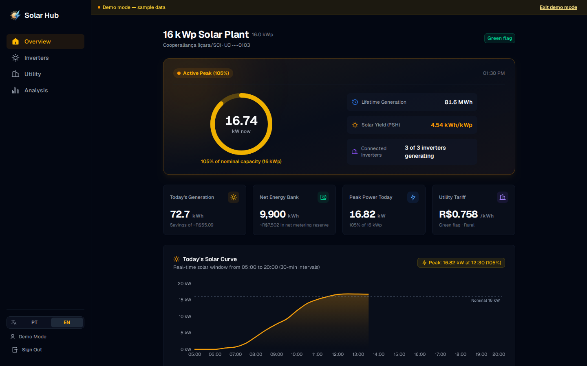
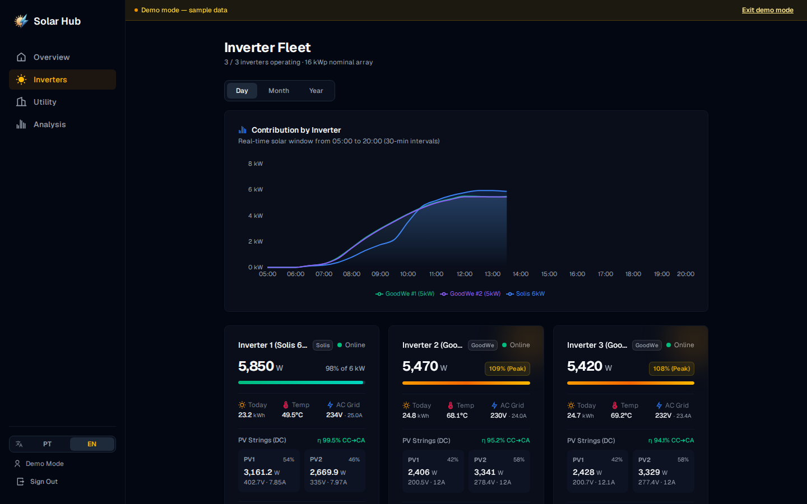
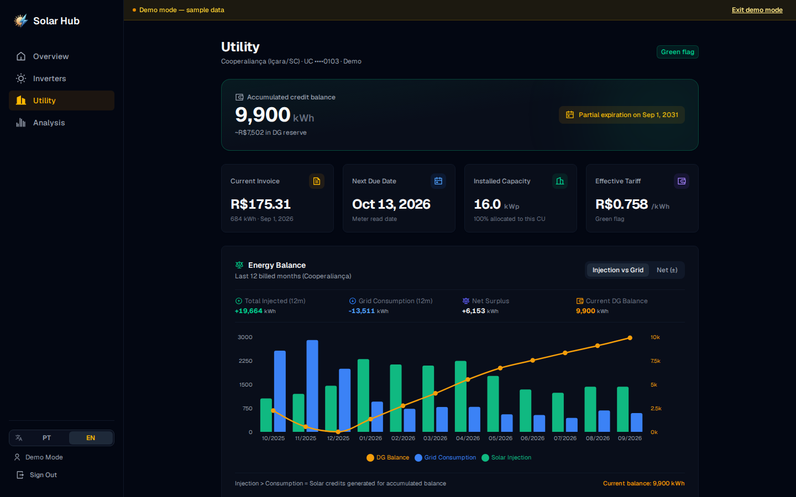
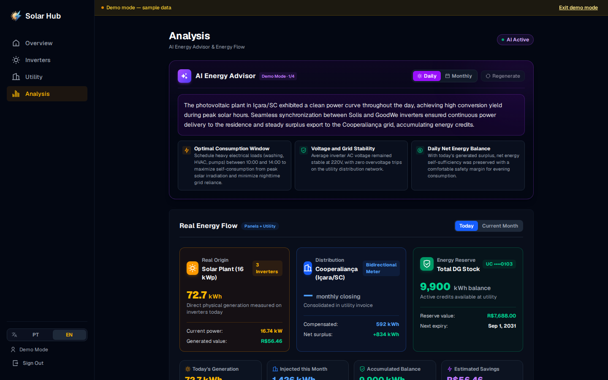
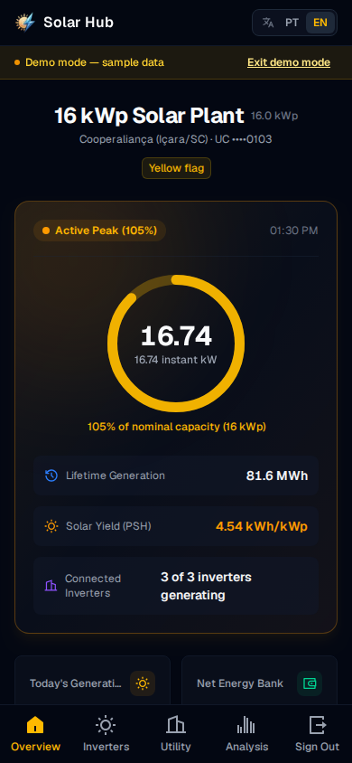
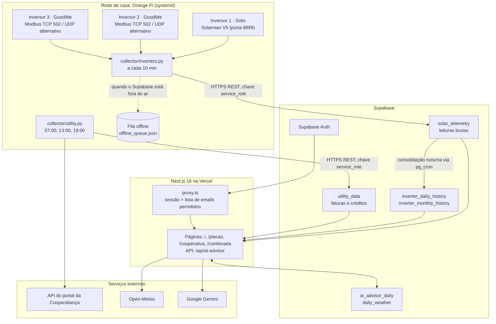

<div align="center">

# Solar Hub

[](https://github.com/DiegoHahn/Solar-hub/actions/workflows/ci.yml)
[](LICENSE)
[](https://solar-hub-diego-2112.vercel.app/demo)

[English version](README.md) • [Demonstração](#demonstração) • [Arquitetura](#arquitetura) • [Instalação](#instalação) • [Testes e CI](#testes-e-ci) • [Limitações conhecidas](#limitações-conhecidas-e-trade-offs) • [O que aprendi](#o-que-aprendi-e-o-que-faria-diferente)

</div>

---

Minha família tem uma pequena usina solar com três inversores de duas marcas diferentes: um Solis e dois GoodWe. Cada marca tem seu próprio app e sua própria nuvem, e nenhum deles mostra a usina inteira em um lugar só. A fatura de energia e os créditos de geração ficam em um terceiro site, o portal da cooperativa de energia local (Cooperaliança).

O Solar Hub junta tudo isso em um dashboard. Um coletor pequeno em Python, rodando em um Orange Pi, lê os inversores direto na rede de casa, envia as leituras para o Supabase e também busca os dados de fatura e de créditos no portal da cooperativa algumas vezes por dia. Um dashboard em Next.js mostra a geração, os detalhes de cada inversor, os créditos, as faturas e uma análise diária escrita pelo Google Gemini a partir desses números.

**Demonstração:** [solar-hub-diego-2112.vercel.app/demo](https://solar-hub-diego-2112.vercel.app/demo). Roda com dados de exemplo embutidos, não pede login e tem botão para trocar entre EN e PT.

## Demonstração

Telas capturadas da [demonstração](https://solar-hub-diego-2112.vercel.app/demo):

<div align="center">
  
</div>

<br />

| Placas e inversores | Cooperativa |
| :---: | :---: |
|  |  |
| **Análise combinada e consultor IA** | **Mobile** |
|  |  |

## O que ele faz

- **Lê os inversores na rede local, sem as nuvens dos fabricantes.** O inversor Solis é lido pelo datalogger Wi-Fi Solarman LSW-3 com o protocolo Solarman V5 (quadros Modbus RTU dentro de um cabeçalho próprio da Solarman, porta 8899), mais a página `status.html` do datalogger. Os GoodWe são lidos via Modbus TCP na porta 502 pela biblioteca [`goodwe`](https://pypi.org/project/goodwe/), com o protocolo UDP como alternativa.
- **Faz a leitura a cada 10 minutos.** O intervalo é o `poll_interval_seconds` do `collector/config.json` (padrão 600). Em cada ciclo os inversores são lidos um depois do outro.
- **Continua funcionando quando a internet cai.** Se o envio ao Supabase falhar, a leitura vai para uma fila local em JSON (limitada a 500 itens) e é enviada em ordem no próximo ciclo que der certo.
- **Evita gastar o cartão SD.** A última leitura e o histórico curto ficam em memória. O coletor só grava em disco a fila offline, ou quando é iniciado com `--save-local`. Os arquivos JSON são gravados em um arquivo temporário e trocados com um rename atômico.
- **Sincroniza os dados da cooperativa.** O `collector/utility.py` faz login na API do portal da Cooperaliança às 07:00, 13:00 e 19:00 (timer do systemd) e guarda o histórico de 60 meses de faturas, os saldos de créditos da geração distribuída e a tarifa atual. Ele também baixa no dispositivo o PDF do informativo mensal de microgeração.
- **Mostra tudo em um dashboard** em inglês e português, com quatro páginas: início, placas, cooperativa e análise combinada.
- **Escreve uma análise diária com o Gemini.** A rota `/api/ai-advisor` manda para o Gemini a telemetria do dia, a última fatura, os créditos e o clima, e recebe de volta uma análise estruturada. Ela não faz previsão; explica os números que já existem. Uma análise por dia e por idioma fica em cache no Supabase, o modelo principal tem um limite diário de chamadas antes de a rota passar para os modelos alternativos, e a geração forçada tem um intervalo mínimo de 10 minutos.
- **Cruza a geração com o clima** do [Open-Meteo](https://open-meteo.com/) (irradiação, horas de sol, chuva), com cache diário na tabela `daily_weather`.

As partes que achei mais interessantes de construir:

- Descobrir o mapa de registradores do Solis (qual holding register é a tensão das strings, a frequência da rede, a geração do dia, a temperatura, e o fator de escala de cada um) e o mapeamento dos sensores da GoodWe. Veja [Protocolos dos inversores](#protocolos-dos-inversores).
- A fila offline e o armazenamento que poupa o cartão SD em um dispositivo que roda 24 horas por dia.
- Testes com dados reais: respostas dos inversores, da API da cooperativa e das consultas do dashboard capturadas da produção e anonimizadas antes do commit (veja o [ADR 0005](docs/adr/0005-tests-with-anonymized-real-data.md)).

## Arquitetura



Os motivos das principais escolhas estão nos [Architecture Decision Records](docs/adr/README.md).

### Protocolos dos inversores

| Inversor | Interface | Protocolo | Principais leituras |
| :--- | :--- | :--- | :--- |
| Solis | Datalogger Wi-Fi Solarman LSW-3 | Solarman V5 na porta 8899, holding registers 0 a 39, mais o `status.html` do datalogger | Potência ativa, tensão, corrente e frequência da rede, tensão e corrente de PV1/PV2, geração do dia e total, temperatura interna, sinal do Wi-Fi |
| GoodWe | Módulo Wi-Fi | Modbus TCP na porta 502 pela biblioteca `goodwe`, UDP como alternativa | Potência, strings, valores da rede, temperaturas, geração do dia e total |

Holding registers do Solis usados pelo parser (`parse_solis_status` em `collector/inverters.py`):

| Registrador | Valor | Escala |
| :---: | :--- | :--- |
| 6 / 7 | Tensão / corrente PV1 | 0,1 V / 0,01 A |
| 8 / 9 | Tensão / corrente PV2 | 0,1 V / 0,01 A |
| 12 | Potência ativa | 10 W |
| 14 / 15 / 16 | Frequência / tensão / corrente da rede | 0,01 Hz / 0,1 V / 0,01 A |
| 22 | Geração total | 1 kWh |
| 25 | Geração do dia | 0,01 kWh |
| 36 | Temperatura interna | 0,1 °C |

### Stack

- **Dashboard:** Next.js 16 (App Router, Server Components), React 19, TypeScript, Tailwind CSS 4, Recharts, primitivos do Radix UI, Remix Icons. A camada de i18n (`pt-BR` e `en`) foi escrita no próprio projeto, sem biblioteca.
- **Coletor:** Python 3.10+, `pysolarmanv5`, `goodwe`, `requests`, rodando pelo systemd em um Orange Pi.
- **Dados:** Supabase (PostgreSQL, Auth, Row Level Security, `pg_cron`). Os detalhes de cada inversor ficam em `JSONB` em cada linha de telemetria.
- **IA:** Google Gemini, chamado por um route handler do Next.js.
- **Hospedagem:** Vercel para o dashboard ([ADR 0003](docs/adr/0003-nextjs-app-router-server-components-gru1.md)).

### Estrutura do repositório

```text
collector/            coletores em Python que rodam no Orange Pi
  inverters.py        leitura dos inversores, fila offline, pequena API REST local (/api/latest, /api/history, /api/health)
  utility.py          sincronização de faturas e créditos da Cooperaliança
  deploy/             units de serviço e timer do systemd
  tests/              testes pytest com fixtures anonimizadas
dashboard/            aplicação Next.js
  src/app/            páginas, /api/ai-advisor, login, rotas da demonstração
  src/lib/            consultas ao Supabase, clima, cota da IA, lista de emails, dados da demonstração
  src/i18n/           dicionários e formatadores
  e2e/                testes Playwright
  scripts/            captura e anonimização de fixtures, checagem da telemetria, screenshots
supabase/migrations/  esquema, políticas RLS, funções, job do pg_cron
docs/adr/             Architecture Decision Records
```

## Instalação

### Requisitos

- Python 3.10+ para o coletor
- Node.js 20.9+ para o dashboard
- Um projeto Supabase com as migrações de `supabase/migrations/` aplicadas

### Coletor

```bash
git clone https://github.com/DiegoHahn/Solar-hub.git
cd Solar-hub/collector

python3 -m venv .venv
source .venv/bin/activate  # Windows: .venv\Scripts\activate
pip install -r requirements.txt

cp .env.example .env                 # credenciais do Supabase e do portal da cooperativa
cp config.example.json config.json   # IPs, números de série e intervalo de leitura
chmod 600 .env
```

Rode um único ciclo para conferir se todos os inversores respondem:

```bash
python3 inverters.py --once
```

Instale as units do systemd para rodar continuamente:

```bash
sudo cp deploy/solar-inverters@.service deploy/solar-utility@.service deploy/solar-utility@.timer /etc/systemd/system/
sudo systemctl daemon-reload
sudo systemctl enable --now solar-inverters@$USER.service
sudo systemctl enable --now solar-utility@$USER.timer
```

### Dashboard

```bash
cd dashboard
npm install
cp .env.example .env.local
npm run dev
```

Depois abra `http://localhost:3000`. A demonstração funciona sem dados no Supabase em `http://localhost:3000/demo`.

### Variáveis de ambiente

**Dashboard** (`dashboard/.env.local` e as configurações do projeto na Vercel):

| Variável | Para que serve |
| :--- | :--- |
| `NEXT_PUBLIC_SUPABASE_URL` | URL do projeto Supabase |
| `NEXT_PUBLIC_SUPABASE_PUBLISHABLE_KEY` | Chave pública (publishable/anon) |
| `ALLOWED_EMAILS` | Emails permitidos, separados por vírgula. Lista vazia bloqueia todo mundo |
| `GEMINI_API_KEY` | Chave do Google AI Studio |
| `GEMINI_MODEL` | Modelo principal do consultor IA |
| `GEMINI_MODEL_FALLBACKS` | Modelos alternativos, separados por vírgula, em ordem |
| `GEMINI_PRIMARY_MAX_QUOTA` | Chamadas diárias ao modelo principal antes de passar para os alternativos |
| `NEXT_PUBLIC_SOLAR_LATITUDE` / `_LONGITUDE` | Localização da usina para o Open-Meteo |
| `NEXT_PUBLIC_SOLAR_TILT` / `_AZIMUTH` | Inclinação e orientação dos painéis, em graus |
| `NEXT_PUBLIC_PLANT_DC_KWP` | Potência DC dos módulos (kWp), usada no performance ratio e nas estimativas |

**Coletor** (`collector/.env`):

| Variável | Para que serve |
| :--- | :--- |
| `SUPABASE_URL` | URL do projeto Supabase |
| `SUPABASE_SERVICE_ROLE_KEY` | Chave de escrita. Ela ignora a RLS, por isso fica só no Orange Pi |
| `COOPERALIANCA_CPF` / `COOPERALIANCA_SENHA` | Login no portal da cooperativa |
| `COOPERALIANCA_TOKEN_EXTERNO` | Token que a API do portal espera no cabeçalho `use-token-externo` |
| `COOPERALIANCA_UCS` | Unidades consumidoras, separadas por vírgula. A primeira é a que tem a usina |

A lista de inversores (IPs, portas, números de série, nome e potência da usina, intervalo de leitura) fica em `collector/config.json`, criado a partir do `collector/config.example.json`.

## Segurança

- **Segredos:** `.env`, `.env.local` e `collector/config.json` estão no `.gitignore`. Só os modelos `*.example` são commitados. O CI roda Trivy (dependências, segredos, configurações) e Semgrep em todo PR.
- **Login:** Supabase Auth com Google ou email e senha, via `@supabase/ssr`. O proxy do Next.js (`dashboard/src/proxy.ts`) renova a sessão a cada requisição, manda para `/login` quem não tem sessão e desloga quem tem um email fora de `ALLOWED_EMAILS`. A lista falha fechada: se a variável estiver vazia, ninguém entra.
- **Cookies de sessão:** o `@supabase/ssr` guarda a sessão em cookies que o cliente do navegador consegue ler, então eles **não** são `httpOnly`. A aplicação envia `X-Frame-Options`, `frame-ancestors 'none'`, `nosniff`, uma política de referrer e uma de permissões, mas ainda não tem CSP para scripts.
- **Banco de dados:** a RLS está ativa em todas as tabelas. As tabelas de telemetria, histórico e cooperativa não têm política de escrita para usuários da aplicação; só a chave `service_role` do coletor escreve nelas. Qualquer usuário autenticado consegue lê-las, e consegue inserir e atualizar `ai_advisor_daily` e `daily_weather`, que o dashboard usa como cache. Veja em [Limitações conhecidas](#limitações-conhecidas-e-trade-offs) o que isso significa.
- **Demonstração:** a rota `/demo` grava um cookie `httpOnly` que troca a fonte de dados por JSON embutido. O modo demonstração nunca consulta o Supabase e nunca chama o Gemini.

## Testes e CI

| Camada | Ferramentas | Comando | O que cobre |
| :--- | :--- | :--- | :--- |
| Unidade e componentes do dashboard | Vitest, Testing Library, MSW | `npm run test:coverage` | Cálculos de geração, limites do fuso de Brasília, normalização dos dados da cooperativa, i18n, estados dos componentes |
| Integração do dashboard | Vitest | `npm run test:integration` | Consultas e RLS contra um projeto Supabase real, contrato do Open-Meteo |
| Ponta a ponta | Playwright | `npm run e2e` | Build de produção: login, proteção de rotas, open redirect, cabeçalhos de segurança, demonstração, layouts |
| Coletor | pytest, ruff | `pytest` | Parsers do Solis e da GoodWe com respostas capturadas, fila offline, envio ao Supabase contra um servidor HTTP local, sincronização da cooperativa |
| No dispositivo | pytest | `pytest -m live` | Inversores reais e o portal real da cooperativa. Roda à mão no Orange Pi |

O CI falha quando a cobertura fica abaixo de 80% (total no coletor; linhas, funções e statements no dashboard, com 70% para branches). O workflow `CI` roda em todo PR: lint, typecheck, testes e build do dashboard; lint, checagem de formatação e testes do coletor em Python 3.10 e 3.14; Trivy; Semgrep. O job de integração e E2E precisa de credenciais reais do Supabase, então roda nos pushes para a `main` e uma vez por dia, não nos PRs.

### Monitoramento da telemetria

O `.github/workflows/monitor.yml` roda a cada 30 minutos entre 06:00 e 19:59 (horário de Brasília) e executa `npm run telemetry:check`. A checagem falha, e o GitHub me avisa por email, se a última linha de telemetria tiver mais de 30 minutos durante o dia, ou se os dados da cooperativa tiverem mais de 26 horas.

Um job noturno do `pg_cron`, às 03:10 (horário de Brasília), consolida os últimos sete dias de telemetria bruta em `inverter_daily_history` e `inverter_monthly_history` e depois apaga as leituras brutas com mais de 90 dias dos dias que já têm total. O dashboard lê primeiro as tabelas de histórico, então os dias antigos continuam com seus totais.

### Fluxo de trabalho

GitHub Flow: toda mudança passa por uma branch e um PR, o CI precisa passar e os PRs entram com squash merge. Push direto na `main` é bloqueado. Os commits seguem [Conventional Commits](https://www.conventionalcommits.org/), e o [release-please](https://github.com/googleapis/release-please) gera o `CHANGELOG.md`, as tags e as releases. A Vercel publica a `main`. O Orange Pi é atualizado à mão (`git pull` e restart do systemd), e as migrações do banco são aplicadas à mão, não pelo CI. Detalhes no [CONTRIBUTING.md](CONTRIBUTING.md).

## Limitações conhecidas e trade-offs

- **A autorização é feita na aplicação, não no banco.** A lista de emails permitidos fica no proxy do Next.js. As políticas de leitura da RLS são `TO authenticated USING (true)`, então qualquer conta que consiga uma sessão válida no Supabase poderia ler todas as tabelas direto pela API do Supabase, inclusive os dados da cooperativa, que têm o CPF do titular. Levar a lista de emails para as políticas de RLS é a próxima correção.
- **O reenvio da fila offline não é idempotente.** `solar_telemetry.recorded_at` não tem restrição única, e o coletor faz um `POST` simples. Se a requisição chegar ao Supabase mas a resposta se perder (um timeout, por exemplo), a leitura continua na fila e é enviada de novo, o que cria uma linha duplicada.
- **A fila tem limite.** Ela guarda as últimas 500 leituras, cerca de três dias e meio com intervalo de 10 minutos. Uma queda mais longa descarta as leituras mais antigas.
- **Três inversores estão parcialmente fixos no código.** O coletor lê quantos inversores houver no `config.json`, mas o histórico em memória tem os campos fixos `inv_1_w` a `inv_3_w`, e só dois tipos de inversor são suportados.
- **É polling, não streaming.** Uma leitura a cada 10 minutos basta para totais diários e gráficos, mas o dashboard nunca está mais atual que o último ciclo, e eventos curtos entre uma leitura e outra não aparecem.
- **A integração com a cooperativa depende de uma API não documentada do portal.** Se a cooperativa mudar o portal, o `utility.py` quebra. Erros de rede e do servidor no login são tentados de novo duas vezes (depois de 1 e de 5 minutos), e o monitoramento acusa dados com mais de 26 horas.
- **Os cookies de sessão podem ser lidos por JavaScript**, como descrito em [Segurança](#segurança).
- **O coletor é um script, não um pacote.** A configuração é carregada na importação, o estado fica em variáveis globais do módulo e os logs são feitos com `print`. Funciona no dispositivo, mas é mais difícil de testar e de estender do que deveria.

## O que aprendi e o que faria diferente

<!-- TODO Diego: revise in your own words -->

- A engenharia reversa dos registradores do Solis levou mais tempo que qualquer outra parte. Capturar respostas reais como fixtures logo no começo permitiu mudar o parser sem precisar ir até o Orange Pi toda vez.
- Checar o acesso só no middleware foi o caminho mais fácil. Da próxima vez eu colocaria a autorização no banco desde o início e trataria a checagem da aplicação como uma segunda camada.
- Eu desenharia a tabela de telemetria com uma chave única e faria toda escrita como upsert desde o primeiro dia. Retentativas e filas offline ficam muito mais simples quando enviar a mesma linha duas vezes não causa problema.
- Eu começaria o coletor como um pacote instalável pequeno, com um objeto de configuração e logging, em vez de um script que foi crescendo.
- Rodar o dashboard contra um banco real no CI pegou bugs que os mocks escondiam, mas também faz com que esses testes não rodem em PRs de forks. Uma instância local do Supabase no CI resolveria isso.

## Licença

MIT. Veja [LICENSE](LICENSE).
